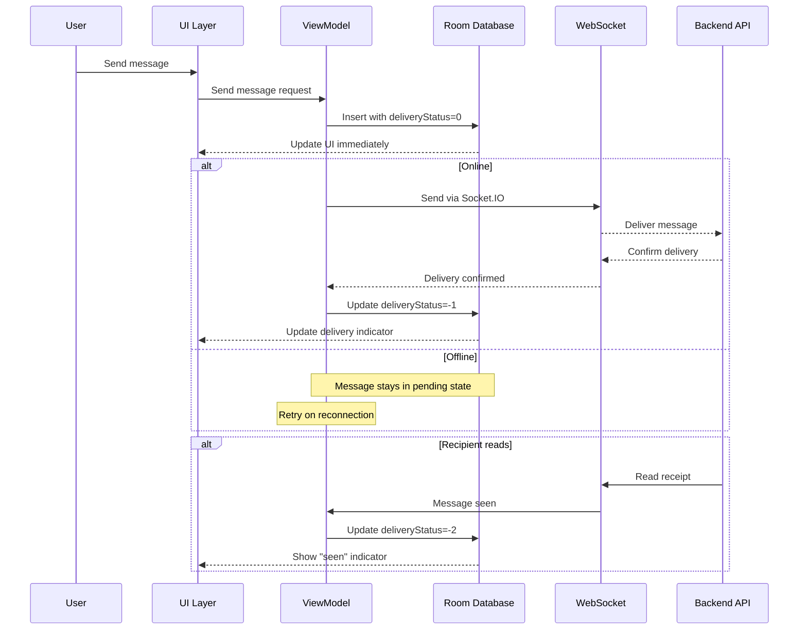

## Overview

Threadly uses **Room Persistence Library**, an abstraction layer over SQLite, to provide robust offline functionality. The database caches critical data including messages, conversation history, and notifications, enabling the app to function seamlessly without network connectivity.

## Database Configuration

### Database Class

The main database class uses the Singleton pattern to ensure a single instance throughout the app lifecycle:

```java
@Database(
    entities = {
        MessageSchema.class, 
        HistorySchema.class, 
        NotificationSchema.class
    },
    version = 1,
    exportSchema = false
)
public abstract class DataBase extends RoomDatabase {
    public static final String DB_NAME = "Threadly";
    public static DataBase instance;

    public static synchronized DataBase getInstance() {
        if (instance == null) {
            instance = Room.databaseBuilder(
                Threadly.getGlobalContext(),
                DataBase.class,
                DB_NAME
            ).build();
        }
        return instance;
    }
    
    // DAO accessors
    public abstract operator MessageDao();
    public abstract HistoryOperator historyOperator();
    public abstract NotificationDao notificationDao();
}
```

Location: `RoomDb/DataBase.java:16`

### Key Configuration Details

- **Database Name**: "Threadly"
- **Version**: 1
- **Entities**: 3 (Messages, History, Notifications)
- **Export Schema**: Disabled (set to `false`)

## Database Entities

### 1. MessageSchema

Stores all chat messages with full metadata:

```java
@Entity(tableName = "messages")
public class MessageSchema {
    @PrimaryKey(autoGenerate = true)
    private long msgId;
    
    @ColumnInfo(name = "messageUid")
    private String messageUid;
    
    @ColumnInfo(name = "conversationId")
    private String conversationId;
    
    @ColumnInfo(name = "replyToMsgId")
    private String replyToMsgId;
    
    @ColumnInfo(name = "senderId")
    private String senderId;
    
    @ColumnInfo(name = "receiverId")
    private String receiverId;
    
    @ColumnInfo(name = "msg")
    private String msg;
    
    @ColumnInfo(name = "type")
    private String type;
    
    @ColumnInfo(name = "postId")
    private int postId;
    
    @ColumnInfo(name = "postLink")
    private String postLink;
    
    @ColumnInfo(name = "timestamp")
    private String timestamp;
    
    @ColumnInfo(name = "deliveryStatus")
    private int deliveryStatus;
    
    @ColumnInfo(name = "isDeleted")
    private boolean isDeleted;
    
    @ColumnInfo(name = "mediaLocalPath")
    private String mediaLocalPath;
    
    @ColumnInfo(name = "mediaUploadState")
    private String mediaUploadState;
    
    @ColumnInfo(name = "totalSize")
    private long totalSize;
    
    @ColumnInfo(name = "uploadedSize")
    private long uploadedSize;
    
    // Constructors, getters, and setters...
}
```

Location: `RoomDb/schemas/MessageSchema.java:8`

#### Message Entity Features

<CardGroup cols={2}>
  <Card title="Message Types" icon="message">
    Supports text, image, video, and post-sharing messages
  </Card>
  
  <Card title="Delivery Tracking" icon="check-double">
    Tracks message delivery status: pending (0), sent (-1), seen (-2)
  </Card>
  
  <Card title="Media Upload" icon="upload">
    Monitors upload progress for media messages
  </Card>
  
  <Card title="Reply Threading" icon="reply">
    Supports message replies via replyToMsgId
  </Card>
</CardGroup>

### 2. HistorySchema

Maintains conversation history for the messages list:

```java
@Entity(tableName = "UsersHistory")
public class HistorySchema {
    @PrimaryKey(autoGenerate = true)
    private int id;
    
    @ColumnInfo(name = "conversationId")
    private String conversationId;
    
    @ColumnInfo(name = "username")
    private String username;
    
    @ColumnInfo(name = "userid")
    private final String userId;
    
    @ColumnInfo(name = "profilePic")
    private String profilePic;
    
    @ColumnInfo(name = "uuid")
    private String uuid;
    
    @ColumnInfo(name = "latestMsg")
    private String msg;
    
    @ColumnInfo(name = "timestamp")
    private String timeStamp;
    
    // Constructors, getters, and setters...
}
```

Location: `RoomDb/schemas/HistorySchema.java:8`

#### History Entity Purpose

- Displays conversation list in Messages tab
- Shows latest message preview
- Stores user profile information for quick access
- Enables offline browsing of recent conversations

### 3. NotificationSchema

Caches interaction notifications (likes, comments, follows):

```java
@Entity(tableName = "notification_schema")
public class NotificationSchema {
    @PrimaryKey(autoGenerate = true)
    int notificationId;
    
    @ColumnInfo(name = "notificationType")
    String notificationType;
    
    @ColumnInfo(name = "insertId")
    int insertId;
    
    @ColumnInfo(name = "userId")
    String userId;
    
    @ColumnInfo(name = "username")
    String username;
    
    @ColumnInfo(name = "profilePic")
    String profilePic;
    
    @ColumnInfo(name = "postId")
    int postId;
    
    @ColumnInfo(name = "commentId")
    public int commentId;
    
    @ColumnInfo(name = "timeStamp")
    public String timeStamp;
    
    @ColumnInfo(name = "postLink")
    String postLink;
    
    @ColumnInfo(name = "isFollowed")
    boolean isFollowed;
    
    @ColumnInfo(name = "isViewed")
    boolean isViewed;
    
    @ColumnInfo(name = "isApproved")
    boolean isApprovedByMe;
    
    // Constructors, getters, and setters...
}
```

Location: `RoomDb/schemas/NotificationSchema.java:8`

#### Notification Types

- **Likes**: Post and comment likes
- **Comments**: New comments on posts
- **Follows**: New followers and follow requests
- **Mentions**: Tagged in posts or comments

## Data Access Objects (DAOs)

### Message DAO (operator)

Provides comprehensive message operations:

```java
@Dao
public interface operator {
    @Insert
    void insertMessage(MessageSchema message);
    
    @Insert
    void insertMessage(List<MessageSchema> messages);

    @Query("SELECT * FROM messages WHERE conversationId=:conversationId " +
           "AND isDeleted=0 GROUP BY messageUid ORDER BY timestamp ASC")
    LiveData<List<MessageSchema>> getMessagesCid(String conversationId);

    @Query("UPDATE messages SET deliveryStatus=:deliveryStatus " +
           "WHERE messageUid=:msgUid AND isDeleted=0")
    void updateDeliveryStatus(String msgUid, int deliveryStatus);

    @Query("SELECT * FROM messages WHERE deliveryStatus=0 AND isDeleted=0")
    List<MessageSchema> getPendingToSendMessages();

    @Query("SELECT count(distinct messageUid) as count FROM messages " +
           "WHERE deliveryStatus=-1 AND receiverId=:rid AND isDeleted=0")
    LiveData<Integer> getUnreadMessagesCount(String rid);

    @Query("SELECT count(distinct conversationId) as count FROM messages " +
           "WHERE deliveryStatus=-1 AND receiverId=:rid AND isDeleted=0")
    LiveData<Integer> getUnreadConversationCount(String rid);

    @Query("SELECT messageUid FROM messages WHERE conversationId=:conversationId " +
           "AND deliveryStatus=-1 AND isDeleted=0")
    List<String> getUnreadMessageUids(String conversationId);

    @Query("UPDATE messages SET deliveryStatus=-2 " +
           "WHERE conversationId=:conversationId AND receiverId=:rid AND isDeleted=0")
    void updateMessagesSeen(String conversationId, String rid);

    @Query("SELECT count(distinct messageUid) FROM messages " +
           "WHERE deliveryStatus=-1 AND receiverId=:rid " +
           "AND conversationId=:cid AND isDeleted=0")
    LiveData<Integer> getConversationUnreadMessagesCount(String cid, String rid);

    @Query("UPDATE messages SET isDeleted=1 WHERE messageUid=:msgUid AND isDeleted=0")
    void deleteMessage(String msgUid);
    
    @Query("SELECT * FROM messages WHERE messageUid=:messageUid AND isDeleted=0 LIMIT 1")
    MessageSchema getMessageWithUid(String messageUid);
    
    @Query("UPDATE messages SET totalSize=:totalSize, uploadedSize=:uploadedSize " +
           "WHERE messageUid=:messageUid AND isDeleted=0")
    void updateUploadProgress(String messageUid, long totalSize, long uploadedSize);
    
    @Query("SELECT * FROM messages WHERE mediaUploadState=:state1 " +
           "AND isDeleted=0 ORDER BY timestamp DESC")
    List<MessageSchema> getAllUnUploadedMessages(String state1);
    
    @Query("UPDATE messages SET postLink=:link, mediaUploadState=:mediaUploadState " +
           "WHERE messageUid=:messageUid AND isDeleted=0")
    void updatePostLinkWithState(String messageUid, String link, String mediaUploadState);
    
    @Query("UPDATE messages SET mediaUploadState=:mediaUploadState " +
           "WHERE messageUid=:messageUid AND isDeleted=0")
    void updateUploadState(String messageUid, String mediaUploadState);

    @Query("SELECT conversationId, count(distinct messageUid) as unreadCount " +
           "FROM messages WHERE deliveryStatus=-1 AND isDeleted=0 " +
           "GROUP BY conversationId")
    LiveData<List<ConvMessageCounter>> getUnreadCountPerConversation();
}
```

Location: `RoomDb/Dao/operator.java:14`

### Key DAO Features

<CardGroup cols={2}>
  <Card title="LiveData Queries" icon="sync">
    Returns LiveData for automatic UI updates when data changes
  </Card>
  
  <Card title="Batch Operations" icon="layer-group">
    Supports inserting multiple messages at once
  </Card>
  
  <Card title="Soft Delete" icon="trash">
    Messages are marked as deleted rather than removed
  </Card>
  
  <Card title="Unread Tracking" icon="envelope">
    Counts unread messages per conversation and globally
  </Card>
</CardGroup>

## Offline Strategy

### Message Flow



### Delivery Status Codes

| Status | Value | Meaning |
|--------|-------|----------|
| Pending | 0 | Not yet sent to server |
| Delivered | -1 | Sent but not read |
| Seen | -2 | Read by recipient |

### Sync Strategy

1. **On App Launch**
   - Fetch recent messages from API
   - Merge with local database
   - Resolve conflicts (server wins)

2. **On Network Restore**
   - Query pending messages (`deliveryStatus=0`)
   - Attempt to send all pending messages
   - Update delivery status on success

3. **On Message Receive**
   - Insert into Room immediately
   - Notify UI via LiveData
   - Update conversation history

## ViewModel Integration

ViewModels provide clean access to database operations:

```java
public class MessagesViewModel extends AndroidViewModel {
    public MessagesViewModel(@NonNull Application application) {
        super(application);
    }
    
    // LiveData automatically updates UI when database changes
    public LiveData<List<MessageSchema>> getMessages(String conversationId) {
        return DataBase.getInstance()
            .MessageDao()
            .getMessagesCid(conversationId);
    }
    
    public LiveData<Integer> getUnreadMsg_count(String userUUid) {
        return DataBase.getInstance()
            .MessageDao()
            .getUnreadMessagesCount(userUUid);
    }
    
    public LiveData<Integer> getUnreadConversationCunt(String userUUid) {
        return DataBase.getInstance()
            .MessageDao()
            .getUnreadConversationCount(userUUid);
    }

    public LiveData<Integer> getConversationUnreadMsg_count(
        String conversationId, 
        String userUUid
    ) {
        return DataBase.getInstance()
            .MessageDao()
            .getConversationUnreadMessagesCount(conversationId, userUUid);
    }
}
```

Location: `viewmodels/MessagesViewModel.java:14`

## Database Operations Best Practices

### 1. Background Thread Execution

All database operations (except LiveData queries) must run on background threads:

```java
Executors.newSingleThreadExecutor().execute(() -> {
    DataBase.getInstance()
        .MessageDao()
        .insertMessage(message);
});
```

### 2. LiveData Observation

Observe LiveData in lifecycle-aware components:

```java
messagesViewModel.getMessages(conversationId).observe(
    this,  // LifecycleOwner
    messages -> {
        // Update RecyclerView
        adapter.submitList(messages);
    }
);
```

### 3. Soft Deletes

Messages are never physically deleted, only marked:

```java
// Soft delete
@Query("UPDATE messages SET isDeleted=1 WHERE messageUid=:msgUid")
void deleteMessage(String msgUid);

// All queries exclude deleted messages
@Query("SELECT * FROM messages WHERE conversationId=:cid AND isDeleted=0")
LiveData<List<MessageSchema>> getMessages(String cid);
```

### 4. Duplicate Prevention

The `GROUP BY messageUid` clause prevents duplicate messages:

```java
@Query("SELECT * FROM messages WHERE conversationId=:conversationId " +
       "AND isDeleted=0 GROUP BY messageUid ORDER BY timestamp ASC")
LiveData<List<MessageSchema>> getMessagesCid(String conversationId);
```

## Performance Optimizations

<CardGroup cols={2}>
  <Card title="Indexed Columns" icon="magnifying-glass">
    Primary keys and frequently queried columns (conversationId, messageUid) are indexed
  </Card>
  
  <Card title="Efficient Queries" icon="bolt">
    Queries use specific column selection and WHERE clauses to minimize data transfer
  </Card>
  
  <Card title="LiveData Caching" icon="database">
    LiveData caches results and only emits when data actually changes
  </Card>
  
  <Card title="Singleton Pattern" icon="circle">
    Single database instance prevents multiple connections and overhead
  </Card>
</CardGroup>

## Testing Database Operations

Room provides testing utilities for unit tests:

```java
@RunWith(AndroidJUnit4.class)
public class MessageDaoTest {
    private DataBase database;
    private operator messageDao;

    @Before
    public void createDb() {
        Context context = ApplicationProvider.getApplicationContext();
        database = Room.inMemoryDatabaseBuilder(context, DataBase.class)
            .allowMainThreadQueries()
            .build();
        messageDao = database.MessageDao();
    }

    @After
    public void closeDb() {
        database.close();
    }

    @Test
    public void writeMessageAndRead() throws Exception {
        MessageSchema message = new MessageSchema(...);
        messageDao.insertMessage(message);
        
        List<MessageSchema> messages = messageDao
            .getMessagesCid(conversationId)
            .getValue();
        
        assertThat(messages.get(0), equalTo(message));
    }
}
```

## Related Documentation

<CardGroup cols={2}>
  <Card title="MVVM Pattern" icon="diagram-project" href="/architecture/mvvm-pattern">
    See how ViewModels interact with the database
  </Card>
  
  <Card title="Project Structure" icon="folder-tree" href="/architecture/project-structure">
    Locate database files in the project
  </Card>
  
  <Card title="Architecture Overview" icon="sitemap" href="/architecture/overview">
    Understand how database fits in overall architecture
  </Card>
</CardGroup>
