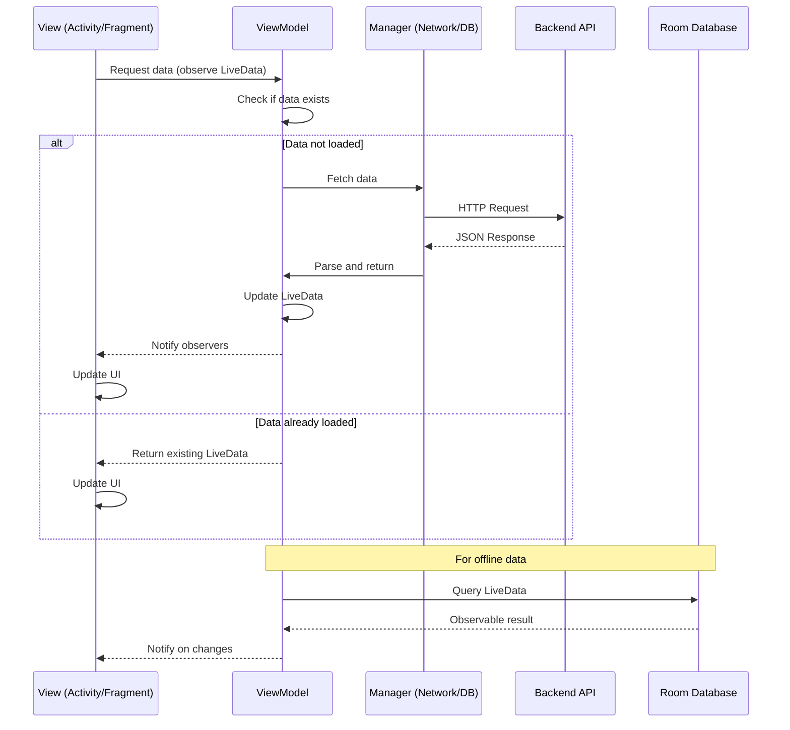

## Overview

Threadly follows the MVVM (Model-View-ViewModel) architectural pattern, which provides clear separation of concerns between UI logic and business logic. This pattern is recommended by Google for Android development and integrates seamlessly with Android Architecture Components.

## MVVM Components

### View Layer (Activities & Fragments)

The View layer consists of Activities and Fragments responsible for:

- Rendering UI components
- Handling user interactions
- Observing ViewModel data changes
- Updating UI based on LiveData emissions

#### Example: HomeActivity

```java
public class HomeActivity extends AppCompatActivity {
    ActivityHomeBinding binding;
    ProfileViewModel profileViewModel;
    ExplorePostsViewModel explorePostsViewModel;

    @Override
    protected void onCreate(Bundle savedInstanceState) {
        super.onCreate(savedInstanceState);
        EdgeToEdge.enable(this);
        binding = ActivityHomeBinding.inflate(getLayoutInflater());
        setContentView(binding.getRoot());
        
        // Initialize ViewModels
        profileViewModel = new ViewModelProvider(this)
            .get(ProfileViewModel.class);
        explorePostsViewModel = new ViewModelProvider(this)
            .get(ExplorePostsViewModel.class);
        
        // Observe LiveData
        observeData();
    }
}
```

Location: `activities/HomeActivity.java:61`

### ViewModel Layer

ViewModels manage UI-related data and survive configuration changes (like screen rotations). They expose LiveData objects that the View layer observes.

#### ProfileViewModel Example

The ProfileViewModel manages user profile data and user posts:

```java
public class ProfileViewModel extends AndroidViewModel {
    ProfileManager profileManager;
    PostsManager postsManager;
    
    boolean isPostLoading = false;
    boolean isLastPage = false;
    int pageNumber = 1;
    
    MutableLiveData<Profile_Model> profileLiveData = new MutableLiveData<>();
    MutableLiveData<ArrayList<Posts_Model>> UserPostsLiveData = new MutableLiveData<>();

    public ProfileViewModel(@NonNull Application application) {
        super(application);
        this.profileManager = new ProfileManager();
        this.postsManager = new PostsManager();
    }

    public LiveData<Profile_Model> getProfileLiveData() {
        if(profileLiveData.getValue() == null) {
            loadProfile();
        }
        return profileLiveData;
    }
    
    public void loadProfile() {
        profileManager.getLoggedInUserProfile(
            new NetworkCallbackInterfaceWithJsonObjectDelivery() {
                @Override
                public void onSuccess(JSONObject response) {
                    Profile_Model userdata;
                    try {
                        JSONArray array = response.getJSONArray("data");
                        JSONObject object = array.getJSONObject(0);
                        userdata = new Profile_Model(
                            object.getString("userid"),
                            object.getString("username"),
                            object.getString("profilepic"),
                            object.getString("bio"),
                            object.getString("dob").split("T")[0],
                            object.getInt("followersCount"),
                            object.getInt("followingCount"),
                            object.getInt("PostsCount"),
                            0, 0,
                            object.getInt("isPrivate") == 1,
                            true
                        );
                        profileLiveData.postValue(userdata);
                    } catch (JSONException e) {
                        profileLiveData.postValue(null);
                    }
                }

                @Override
                public void onError(String err) {
                    profileLiveData.postValue(null);
                }
            });
    }
}
```

Location: `viewmodels/ProfileViewModel.java:24`

#### MessagesViewModel Example

The MessagesViewModel demonstrates Room Database integration:

```java
public class MessagesViewModel extends AndroidViewModel {
    public MessagesViewModel(@NonNull Application application) {
        super(application);
    }
    
    public LiveData<List<MessageSchema>> getMessages(String conversationId) {
        return DataBase.getInstance()
            .MessageDao()
            .getMessagesCid(conversationId);
    }
    
    public LiveData<Integer> getUnreadMsg_count(String userUUid) {
        return DataBase.getInstance()
            .MessageDao()
            .getUnreadMessagesCount(userUUid);
    }
    
    public LiveData<Integer> getUnreadConversationCunt(String userUUid) {
        return DataBase.getInstance()
            .MessageDao()
            .getUnreadConversationCount(userUUid);
    }

    public LiveData<Integer> getConversationUnreadMsg_count(
        String conversationId, 
        String userUUid
    ) {
        return DataBase.getInstance()
            .MessageDao()
            .getConversationUnreadMessagesCount(conversationId, userUUid);
    }
}
```

Location: `viewmodels/MessagesViewModel.java:14`

### Model Layer

The Model layer consists of:

1. **Data Models (POJOs)**: Plain Old Java Objects representing data structures
2. **Network Managers**: Handle API communication
3. **Room Database Entities**: Local data persistence

## Available ViewModels

Threadly includes the following ViewModels, each managing specific feature data:

<CardGroup cols={2}>
  <Card title="ProfileViewModel" icon="user">
    Manages user profile data and user posts with pagination support
  </Card>
  
  <Card title="MessagesViewModel" icon="message">
    Handles real-time messaging data from Room Database
  </Card>
  
  <Card title="CommentsViewModel" icon="comments">
    Manages post comments and interactions
  </Card>
  
  <Card title="SearchViewModel" icon="magnifying-glass">
    Handles user and content search functionality
  </Card>
  
  <Card title="StoriesViewModel" icon="circle-play">
    Manages stories feed and viewing
  </Card>
  
  <Card title="ExplorePostsViewModel" icon="compass">
    Handles explore/discover feed with various post types
  </Card>
  
  <Card title="InteractionNotificationViewModel" icon="bell">
    Manages notification data and unread counts
  </Card>
  
  <Card title="SuggestUsersViewModel" icon="user-plus">
    Provides user suggestions for following
  </Card>
</CardGroup>

## LiveData Usage

### What is LiveData?

LiveData is an observable data holder class that is lifecycle-aware. It ensures UI updates only happen when the UI is in an active state.

### Benefits in Threadly

1. **Automatic UI Updates**: When data changes, observers are notified automatically
2. **Lifecycle Awareness**: No memory leaks or crashes due to stopped activities
3. **Configuration Change Handling**: Data persists across screen rotations
4. **Room Integration**: DAOs return LiveData for reactive database queries

### Common Patterns

#### Lazy Loading

```java
public LiveData<Profile_Model> getProfileLiveData() {
    if(profileLiveData.getValue() == null) {
        loadProfile();  // Load only if not already loaded
    }
    return profileLiveData;
}
```

#### Pagination

```java
public void loadMorePosts() {
    if(!isPostLoading && !isLastPage) {
        pageNumber++;
        isPostLoading = true;
        postsManager.getLoggedInUserPost(
            pageNumber,
            new NetworkCallbackInterfaceWithJsonObjectDelivery() {
                @Override
                public void onSuccess(JSONObject response) {
                    ArrayList<Posts_Model> tempArrayList = 
                        UserPostsLiveData.getValue();
                    try {
                        JSONArray data = response.getJSONArray("data");
                        if(data.length() == 0) {
                            isPostLoading = false;
                            isLastPage = true;
                            return;
                        }
                        // Add new posts to existing list
                        for(int i = 0; i < data.length(); i++) {
                            tempArrayList.add(parsePost(data.getJSONObject(i)));
                        }
                        UserPostsLiveData.postValue(tempArrayList);
                        isPostLoading = false;
                    } catch (JSONException e) {
                        isPostLoading = false;
                    }
                }
                
                @Override
                public void onError(String err) {
                    isPostLoading = false;
                }
            });
    }
}
```

Location: `viewmodels/ProfileViewModel.java:137`

#### Room Database LiveData

```java
// In ViewModel
public LiveData<List<MessageSchema>> getMessages(String conversationId) {
    return DataBase.getInstance()
        .MessageDao()
        .getMessagesCid(conversationId);
}

// In Fragment/Activity
messagesViewModel.getMessages(conversationId).observe(this, messages -> {
    // Update RecyclerView adapter
    messageAdapter.updateMessages(messages);
});
```

## Data Flow



## Best Practices Implemented

### 1. No Context References in ViewModel

ViewModels use `AndroidViewModel` which provides Application context safely:

```java
public class ProfileViewModel extends AndroidViewModel {
    public ProfileViewModel(@NonNull Application application) {
        super(application);
        // Safe to use application context
    }
}
```

### 2. ViewModels Don't Know About Views

ViewModels never reference UI components directly - they only expose data:

```java
// Good: ViewModel exposes data
public LiveData<Profile_Model> getProfileLiveData() {
    return profileLiveData;
}

// Bad: ViewModel updating UI directly (not done in Threadly)
// public void updateTextView(TextView textView) { ... }
```

### 3. Single Responsibility

Each ViewModel focuses on a specific feature:

- `ProfileViewModel`: User profile and posts
- `MessagesViewModel`: Messaging data
- `CommentsViewModel`: Comment interactions

### 4. Thread Safety

LiveData updates use `postValue()` for background thread safety:

```java
public void onSuccess(JSONObject response) {
    // postValue is thread-safe, can be called from background thread
    profileLiveData.postValue(userdata);
}
```

## Related Documentation

<CardGroup cols={2}>
  <Card title="Project Structure" icon="folder-tree" href="/architecture/project-structure">
    See where ViewModels fit in the overall project
  </Card>
  
  <Card title="Database" icon="database" href="/architecture/database">
    Learn how ViewModels integrate with Room
  </Card>
  
  <Card title="Architecture Overview" icon="sitemap" href="/architecture/overview">
    Understand the complete architecture
  </Card>
</CardGroup>
