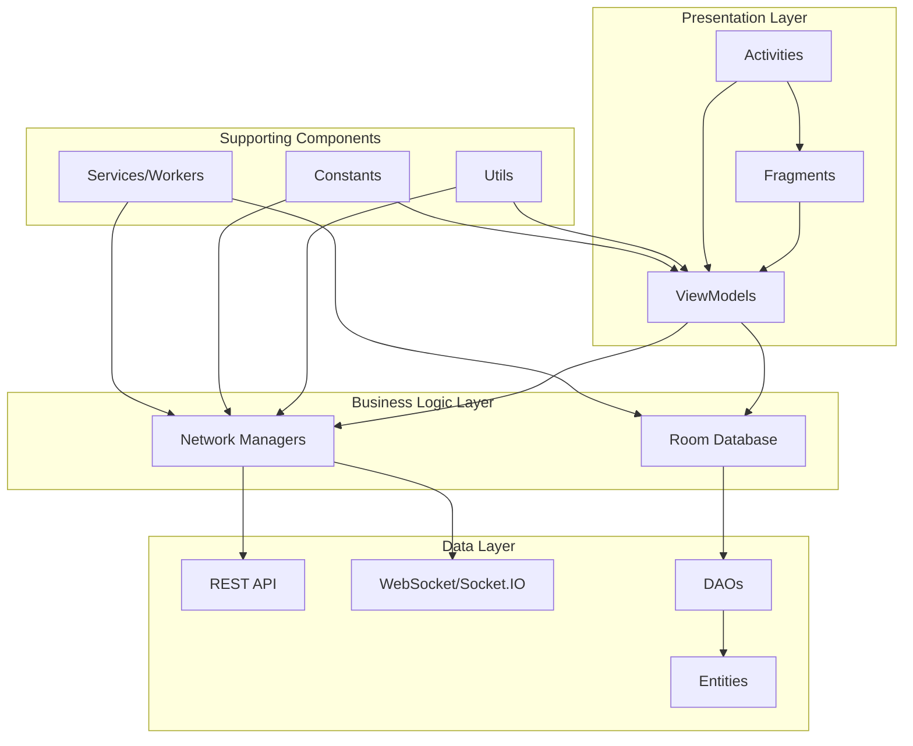

## Introduction

Threadly is built as a native Android application following modern Android development best practices. The architecture emphasizes separation of concerns, testability, and maintainability through well-defined layers and design patterns.

## Technology Stack

### Core Technologies

- **Language**: Java (with Kotlin support)
- **Build System**: Gradle with version catalogs
- **Target SDK**: Android 14 (API 36)
- **Minimum SDK**: Android 10 (API 29)

### Key Libraries & Frameworks

<CardGroup cols={2}>
  <Card title="Architecture Components" icon="layer-group">
    - AndroidX Core & AppCompat
    - Navigation Components
    - ViewBinding for type-safe view access
    - WorkManager for background tasks
  </Card>
  
  <Card title="Data & Networking" icon="database">
    - Room Database for local persistence
    - Fast Android Networking for HTTP requests
    - Socket.IO for real-time messaging
    - SharedPreferences for user sessions
  </Card>
  
  <Card title="UI & Media" icon="image">
    - Material Design Components
    - Glide & Coil for image loading
    - CameraX for camera functionality
    - ExoPlayer (Media3) for video playback
  </Card>
  
  <Card title="Cloud Services" icon="cloud">
    - Firebase Cloud Messaging (FCM)
    - Custom backend API integration
  </Card>
</CardGroup>

## Architecture Layers

Threadly follows a layered architecture pattern with clear separation between UI, business logic, and data layers.



## Design Patterns

### MVVM (Model-View-ViewModel)

The application uses the MVVM pattern as its primary architectural pattern:

- **View**: Activities and Fragments handle UI rendering and user interactions
- **ViewModel**: Manages UI-related data and survives configuration changes
- **Model**: Data classes (POJO) and business logic through network managers

See [MVVM Pattern](/architecture/mvvm-pattern) for detailed implementation.

### Repository Pattern

While not explicitly using Repository classes, the application implements repository-like behavior through:

- **Network Managers**: Handle remote data fetching
- **Room DAOs**: Handle local data operations
- **ViewModels**: Coordinate between data sources

### Observer Pattern

Extensive use of LiveData for reactive data observation:

```java
// ViewModels expose LiveData
public LiveData<Profile_Model> getProfileLiveData() {
    if(profileLiveData.getValue() == null) {
        loadProfile();
    }
    return profileLiveData;
}

// Activities/Fragments observe the data
viewModel.getProfileLiveData().observe(this, profile -> {
    // Update UI with profile data
});
```

### Singleton Pattern

Used for database and core application components:

```java
public static synchronized DataBase getInstance() {
    if (instance == null) {
        instance = Room.databaseBuilder(
            Threadly.getGlobalContext(),
            DataBase.class,
            DB_NAME
        ).build();
    }
    return instance;
}
```

## Key Architectural Decisions

### Offline-First Approach

Threadly implements offline capabilities through:

- **Room Database**: Caches messages, notifications, and conversation history
- **Message Queue**: Stores pending messages when offline
- **Sync Strategy**: Syncs with server when connection is restored

### Real-time Communication

- **Socket.IO**: Powers real-time messaging features
- **FCM**: Handles push notifications for background updates
- **WorkManager**: Manages background sync operations

### Modular UI Structure

The UI is organized into feature-based modules:

- Authentication flows (login, register, password reset)
- Feed and content viewing (posts, reels, stories)
- Messaging system
- User profiles and settings
- Search and discovery

### State Management

- **ViewModels**: Retain data across configuration changes
- **LiveData**: Provides lifecycle-aware observable data holders
- **SharedPreferences**: Stores user session and preferences

## Build Configuration

The application uses BuildConfig fields for environment-specific configuration:

```gradle
buildTypes {
    debug {
        buildConfigField "String", "BASE_URL", 
            "\"https://threadlyserver.onrender.com/api\""
        buildConfigField "String", "SOCKET_URL", 
            "\"https://threadlyserver.onrender.com/\""
    }
    release {
        buildConfigField "String", "BASE_URL", 
            "\"https://threadlyserver.onrender.com/api\""
        minifyEnabled false
    }
}
```

## Next Steps

<CardGroup cols={2}>
  <Card title="MVVM Pattern" icon="diagram-project" href="/architecture/mvvm-pattern">
    Deep dive into MVVM implementation with real examples
  </Card>
  
  <Card title="Project Structure" icon="folder-tree" href="/architecture/project-structure">
    Explore the complete package and directory organization
  </Card>
  
  <Card title="Database" icon="database" href="/architecture/database">
    Learn about Room Database implementation
  </Card>
  
  <Card title="API Reference" icon="code" href="/api/auth-manager">
    Explore the API endpoints and integrations
  </Card>
</CardGroup>
