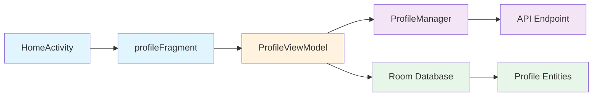

## Overview

Threadly follows a feature-based and layer-based hybrid package structure, organizing code by both functionality and architectural layer. This approach makes it easy to locate related code and maintain clear boundaries between different parts of the application.

## Root Package Structure

All Java source code is located under:
```
app/src/main/java/com/rtech/threadly/
```

## Package Organization

### Core Packages

<AccordionGroup>
  <Accordion title="activities" icon="window-maximize">
    Contains all Activity classes organized by feature:
    
    ```
    activities/
    ├── HomeActivity.java
    ├── AddPostActivity.java
    ├── AddStoryActivity.java
    ├── PostActivity.java
    ├── UserProfileActivity.java
    ├── NotificationActivity.java
    ├── FollowerFollowingList.java
    ├── authActivities/
    │   ├── loginActivities/
    │   ├── registerActivities/
    │   └── forgetPassword/
    ├── Messenger/
    ├── CustomFeedActivity/
    └── settings/
    ```
    
    **Purpose**: Activities serve as entry points and host fragments. HomeActivity is the main container for the bottom navigation.
  </Accordion>

  <Accordion title="fragments" icon="table-cells">
    UI fragments organized by feature area:
    
    ```
    fragments/
    ├── homeFragment.java
    ├── ReelsFragment.java
    ├── AddPostMainFragment.java
    ├── PostAddCameraFragment.java
    ├── UploadPostFinalFragment.java
    ├── UsersListFragment.java
    ├── MessageUserListFragment.java
    ├── profileFragments/
    │   ├── profileFragment.java
    │   ├── EditProfileMainFragment.java
    │   ├── EditNameFragment.java
    │   ├── EditBioFragment.java
    │   ├── UsernameEditFragment.java
    │   ├── ChangeProfileImageSelector.java
    │   ├── ChangeProfileCameraFragment.java
    │   └── profileUploadFinalPreview.java
    ├── searchFragments/
    │   ├── searchFragment.java
    │   └── ResultChildFragments/
    ├── MessageFragments/
    ├── CustomPostFeed/
    ├── storiesFragment/
    ├── notification/
    ├── follower_following_fragments/
    ├── settingFragments/
    └── common_ui_pages/
    ```
    
    **Purpose**: Reusable UI components that make up the app's screens. Each fragment handles a specific piece of UI functionality.
  </Accordion>

  <Accordion title="viewmodels" icon="diagram-project">
    ViewModel classes for MVVM architecture:
    
    ```
    viewmodels/
    ├── ProfileViewModel.java
    ├── MessagesViewModel.java
    ├── CommentsViewModel.java
    ├── SearchViewModel.java
    ├── StoriesViewModel.java
    ├── ExplorePostsViewModel.java
    ├── ImagePostsFeedViewModel.java
    ├── VideoPostsFeedViewModel.java
    ├── InteractionNotificationViewModel.java
    ├── MessageAbleUsersViewModel.java
    ├── SuggestUsersViewModel.java
    └── UsersMessageHistoryProfileViewModel.java
    ```
    
    **Purpose**: Manage UI-related data and business logic. ViewModels survive configuration changes and expose LiveData to the UI layer.
    
    See [MVVM Pattern](/architecture/mvvm-pattern) for implementation details.
  </Accordion>

  <Accordion title="adapters" icon="list">
    RecyclerView adapters for displaying lists:
    
    ```
    adapters/
    ├── postsAdapters/
    ├── commentsAdapter/
    ├── storiesAdapters/
    ├── messanger/
    │   └── helpers/
    ├── NotificationAdapters/
    ├── followersAdapters/
    ├── followRequestsAdapter/
    ├── SearchPage/
    ├── mediaExplorerAdapter/
    └── mscs/
    ```
    
    **Purpose**: Bind data to RecyclerView components for efficient list rendering. Each adapter is specialized for its content type.
  </Accordion>

  <Accordion title="models" icon="cube">
    Data model classes (POJOs):
    
    ```
    models/
    ├── Profile_Model.java
    ├── Posts_Model.java
    ├── ExtendedPostModel.java
    ├── Preview_Post_model.java
    ├── Comment_Model.java
    ├── Story_Model.java
    ├── Notification_Model.java
    └── ... (other model classes)
    ```
    
    **Purpose**: Plain Java objects representing data structures used throughout the app.
  </Accordion>

  <Accordion title="network_managers" icon="network-wired">
    API communication and network layer:
    
    ```
    network_managers/
    ├── AndroidNetworkingLayer.java
    ├── AuthManager.java
    ├── PostsManager.java
    ├── ProfileManager.java
    ├── MessageManager.java
    ├── CommentsManager.java
    ├── LikeManager.java
    ├── FollowManager.java
    ├── OtpManager.java
    ├── FcmManager.java
    ├── PrivacyManager.java
    └── ... (other managers)
    ```
    
    **Purpose**: Handle all HTTP requests and API interactions. Each manager focuses on a specific domain (posts, auth, messages, etc.).
    
    **Example**:
    ```java
    public class PostsManager {
        SharedPreferences loginInfo;
        
        public PostsManager() {
            loginInfo = Core.getPreference();
        }
        
        private String getToken() {
            return loginInfo.getString(
                SharedPreferencesKeys.JWT_TOKEN, 
                "null"
            );
        }
        
        public void uploadImagePost(
            File imagefile, 
            String caption, 
            NetworkCallbackInterfaceWithProgressTracking callback
        ) {
            String url = ApiEndPoints.ADD_IMAGE_POST;
            AndroidNetworking.upload(url)
                .setPriority(Priority.HIGH)
                .addHeaders("Authorization", "Bearer " + getToken())
                .addMultipartFile("image", imagefile)
                .addMultipartParameter("caption", caption)
                .build()
                .setUploadProgressListener((bytesUploaded, totalBytes) -> {
                    callback.progress(bytesUploaded, totalBytes);
                })
                .getAsJSONObject(new JSONObjectRequestListener() {
                    @Override
                    public void onResponse(JSONObject response) {
                        callback.onSuccess(response);
                    }
                    // ... error handling
                });
        }
    }
    ```
  </Accordion>
</AccordionGroup>

### Data Layer Packages

<AccordionGroup>
  <Accordion title="RoomDb" icon="database">
    Local database implementation using Room:
    
    ```
    RoomDb/
    ├── DataBase.java          # Room database instance
    ├── schemas/               # Entity classes
    │   ├── MessageSchema.java
    │   ├── HistorySchema.java
    │   └── NotificationSchema.java
    └── Dao/                   # Data Access Objects
        ├── operator.java      # Message DAO
        ├── HistoryOperator.java
        └── NotificationDao.java
    ```
    
    **Purpose**: Provides offline caching and persistence for messages, conversation history, and notifications.
    
    See [Database Architecture](/architecture/database) for detailed information.
  </Accordion>

  <Accordion title="POJO" icon="box">
    Plain Old Java Objects for data transfer:
    
    ```
    POJO/
    ├── ConvMessageCounter.java
    └── ... (other data transfer objects)
    ```
    
    **Purpose**: Simple data containers, often used for Room query results or data transfer between layers.
  </Accordion>
</AccordionGroup>

### Supporting Packages

<AccordionGroup>
  <Accordion title="interfaces" icon="plug">
    Callback interfaces for component communication:
    
    ```
    interfaces/
    ├── NetworkCallBacks/
    │   ├── NetworkCallbackInterfaceJsonObject.java
    │   └── NetworkCallbackInterfaceWithJsonObjectDelivery.java
    ├── NetworkCallbackInterface.java
    ├── NetworkCallbackInterfaceWithProgressTracking.java
    ├── FragmentItemClickInterface.java
    ├── OnDestroyFragmentCallback.java
    ├── Post_fragmentSetCallback.java
    ├── StoryOpenCallback.java
    ├── StoriesBackAndForthInterface.java
    ├── Comments/
    │   └── RecyclerView/
    │       └── replyClick/
    ├── Messanger/
    └── general_ui_callbacks/
    ```
    
    **Purpose**: Define contracts for callbacks, click handlers, and inter-component communication.
  </Accordion>

  <Accordion title="utils" icon="wrench">
    Utility classes and helper functions:
    
    ```
    utils/
    ├── ReUsableFunctions.java
    ├── ExoplayerUtil.java
    └── ... (other utilities)
    ```
    
    **Purpose**: Common functionality used across the app like date formatting, validation, media utilities, etc.
  </Accordion>

  <Accordion title="constants" icon="hashtag">
    Application constants and enums:
    
    ```
    constants/
    ├── ApiEndPoints.java
    ├── SharedPreferencesKeys.java
    ├── HomeActivityFragmentsIdEnum.java
    └── ... (other constants)
    ```
    
    **Purpose**: Centralize constant values, API endpoints, and configuration keys.
  </Accordion>

  <Accordion title="core" icon="microchip">
    Core application components:
    
    ```
    core/
    └── Core.java              # Application-wide utilities
    ```
    
    **Purpose**: Provides global access to application context, shared preferences, and other core services.
  </Accordion>

  <Accordion title="SocketIo" icon="bolt">
    Real-time WebSocket communication:
    
    ```
    SocketIo/
    └── ... (Socket.IO client implementation)
    ```
    
    **Purpose**: Manages WebSocket connections for real-time messaging features.
  </Accordion>

  <Accordion title="services" icon="gear">
    Background services:
    
    ```
    services/
    └── ... (Service classes for FCM, etc.)
    ```
    
    **Purpose**: Handle background operations like push notifications and long-running tasks.
  </Accordion>

  <Accordion title="workers" icon="briefcase">
    WorkManager background jobs:
    
    ```
    workers/
    └── ... (Worker classes for scheduled tasks)
    ```
    
    **Purpose**: Execute scheduled background tasks like data sync, cleanup, etc.
  </Accordion>
</AccordionGroup>

## File Naming Conventions

### Activities
- Format: `FeatureActivity.java`
- Examples: `HomeActivity.java`, `PostActivity.java`, `UserProfileActivity.java`

### Fragments
- Format: `featureFragment.java` or `FeatureFragment.java`
- Examples: `homeFragment.java`, `ReelsFragment.java`, `searchFragment.java`

### ViewModels
- Format: `FeatureViewModel.java`
- Examples: `ProfileViewModel.java`, `MessagesViewModel.java`

### Managers
- Format: `FeatureManager.java`
- Examples: `PostsManager.java`, `AuthManager.java`

### Adapters
- Format: `FeatureAdapter.java` or organized in feature folders
- Examples: `postsAdapters/`, `commentsAdapter/`

### Models
- Format: `Feature_Model.java`
- Examples: `Profile_Model.java`, `Posts_Model.java`

### Room Entities
- Format: `FeatureSchema.java`
- Examples: `MessageSchema.java`, `NotificationSchema.java`

### DAOs
- Format: `FeatureDao.java` or `FeatureOperator.java`
- Examples: `operator.java`, `NotificationDao.java`, `HistoryOperator.java`

## Project Statistics

Based on the source code structure:

<CardGroup cols={3}>
  <Card title="ViewModels" icon="diagram-project">
    12+ ViewModels
  </Card>
  
  <Card title="Network Managers" icon="network-wired">
    10+ API Managers
  </Card>
  
  <Card title="Database Entities" icon="table">
    3 Room Entities
  </Card>
  
  <Card title="Activity Features" icon="window-maximize">
    9+ Main Activities
  </Card>
  
  <Card title="Fragment Features" icon="table-cells">
    20+ Fragment Groups
  </Card>
  
  <Card title="Adapter Types" icon="list">
    10+ Adapter Categories
  </Card>
</CardGroup>

## Architecture Flow Example

Here's how a typical feature flows through the structure:



1. **HomeActivity** hosts the fragment container
2. **profileFragment** displays the UI and observes data
3. **ProfileViewModel** manages data and state
4. **ProfileManager** handles API calls
5. **API Endpoint** provides remote data
6. **Room Database** provides offline data
7. **Entities** define database schema

## Benefits of This Structure

<CardGroup cols={2}>
  <Card title="Feature Isolation" icon="layer-group">
    Related code is grouped together, making features easy to locate and modify
  </Card>
  
  <Card title="Scalability" icon="chart-line">
    New features can be added without affecting existing code structure
  </Card>
  
  <Card title="Team Collaboration" icon="users">
    Multiple developers can work on different packages simultaneously
  </Card>
  
  <Card title="Testability" icon="vial">
    Clear separation makes unit testing and mocking straightforward
  </Card>
  
  <Card title="Maintenance" icon="screwdriver-wrench">
    Issues can be quickly traced to the appropriate package
  </Card>
  
  <Card title="Code Reusability" icon="recycle">
    Utilities, interfaces, and models are shared across features
  </Card>
</CardGroup>

## Related Documentation

<CardGroup cols={2}>
  <Card title="MVVM Pattern" icon="diagram-project" href="/architecture/mvvm-pattern">
    Learn how ViewModels fit into the architecture
  </Card>
  
  <Card title="Database" icon="database" href="/architecture/database">
    Explore the Room Database structure
  </Card>
  
  <Card title="Architecture Overview" icon="sitemap" href="/architecture/overview">
    Understand the complete system design
  </Card>
</CardGroup>
